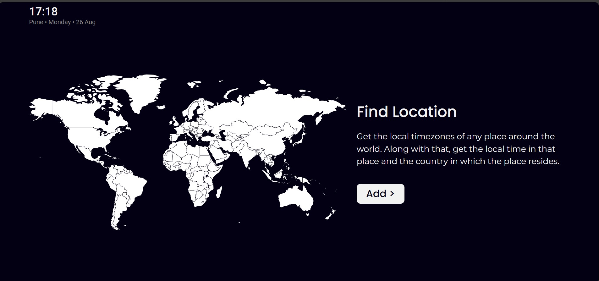
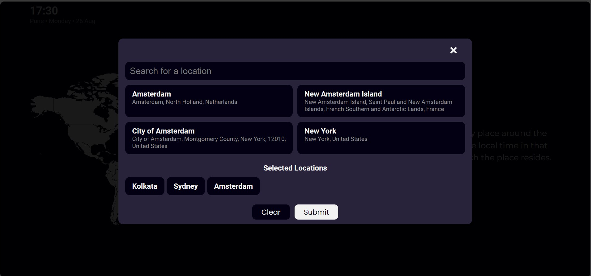
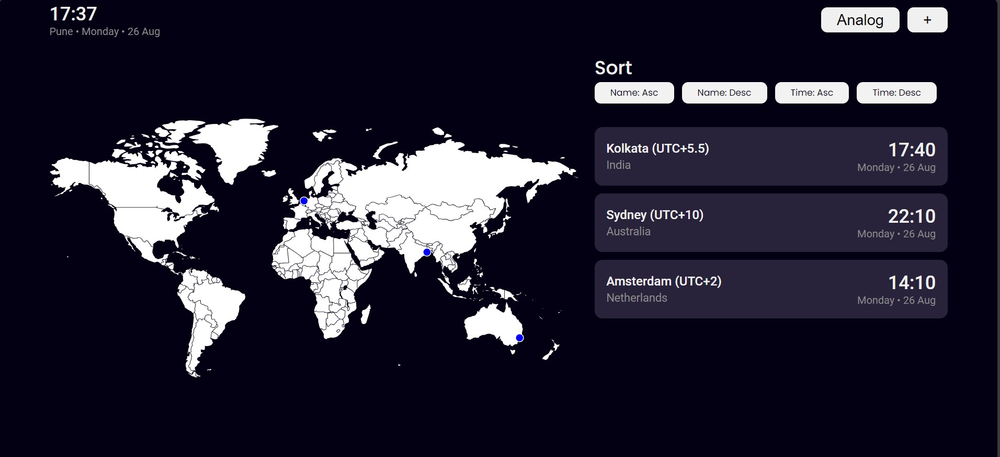
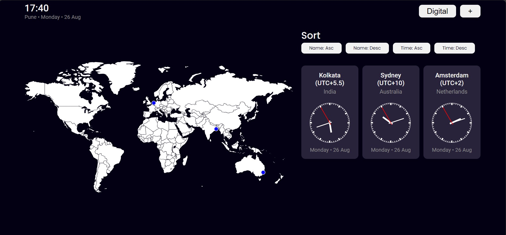
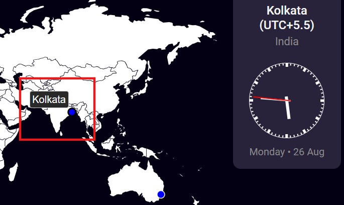
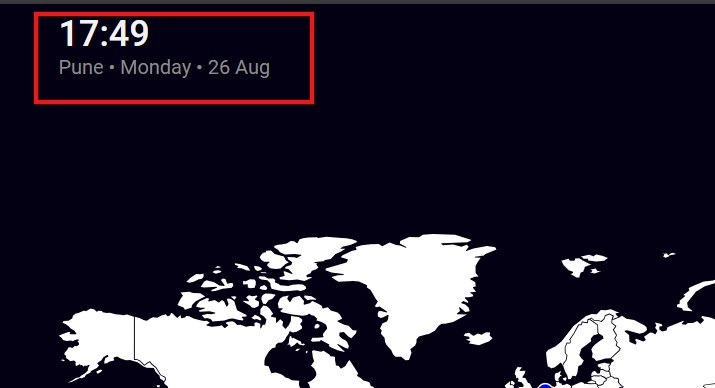
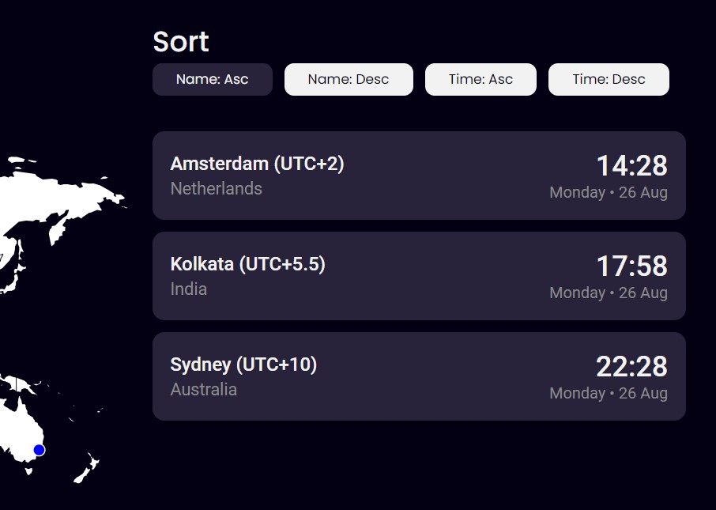
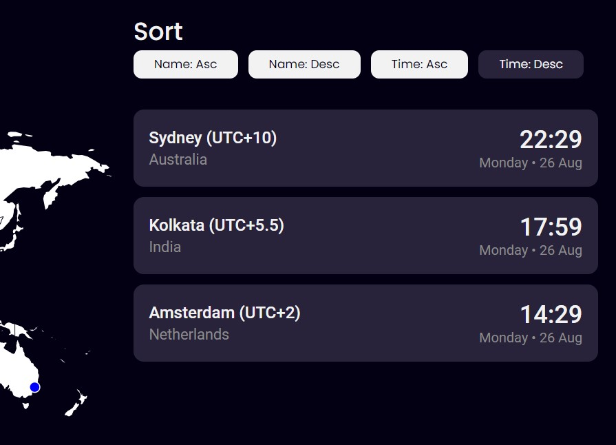

# TimeZone App

## Contents
1. [Features](#features)
2. [Setup Instructions](#setup-instructions)
3. [References](#references)

## Features

### On page load, a short description is displayed

When the page is loaded, a short description of the usage of this app is displayed along with a blank world map. A button is also provided to add a new place for which time data needs to be displayed.



### Modal to add locations

In the modal to add locations, we are presented with an input box. Here, we can add the location for which we want to view the time data. On clicking on Enter, we are displayed 4 cards which show the 4 closest possible matches to the location entered. We will choose any location that matches the one that we are looking for. This selected location will get added to the *Selected Locations* section. Similarly, we can add multiple locations.

Finally, if we are satisfied with our selections, we will select *Submit* button. If we want to clear our selection list, we can click the *Clear* button.



### Search for any location around the world

In the search input box in the modal, we can put in any possible location or address around the world. The entered location string is determined by a Geocoding API and the locations which are closely matching with the entered string is returned. From these, we can select which particular location we are interested in.

### Data displayed in both digital and analog clocks

On finalizing the locations, we can view the time data as both digital and analog clocks. On load, we are presented with digital clocks for each of the locations selected.



To see clocks in analog format, we can select the *Analog* button on the upper right corner of screen. The clocks for each of the locations selected will be displayed in analog format.



Along with the time and date of the location we have selected, we are also presented with the country in which the selected location resides, and the timezone of that location with respect to UTC (Coordinated Universal Time).

On the upper right corner, we also see a *+* button. Clicking this again opens up the location search modal which can be used to add subsequent locations after the initial selection.

### Worldmap shows the selected locations

In the worldmap, the selected locations are shown as blue-coloured markers. On hovering over these markers, the name of the location is displayed as a tooltip.



### Current location and time is displayed

On the top-left corner of the screen, we see the current time and location of the place from where this app is being used. For accessing, the location, user has to give consent for the app to use it's current location. This consent is asked by the browser on the first time this app is loaded. If user does not give consent, then only the time is displayed and current location is not displayed.



### Locations can be sorted based on name and time

The locations in the list can be sorted based on the following:

1. Ascending order based on it's name
2. Descending order based on it's name
3. Ascending order based on it's time. Places on the west come before than those on the east.
4. Descending order based on it's time. Places on the east come before that those on the west.





## Setup Instructions

**Step 1:** Install NodeJS in system (if not already installed) from [official website](https://nodejs.org/en).

**Step 2:** Clone the GitHub repository in local system.

```bash
https://github.com/soumalyapakrashi/world-time-converter.git
```

**Step 3:** Open a terminal in the downloaded folder *world-time-converter* and install the dependencies of the project by running the following command.

```bash
npm install
```

**Step 4:** Run the development build of the app locally by running the following command.

```bash
npm start
```

## References

1. Geocoding API: [Nominatim](https://nominatim.org/)
2. Timezone API: [The Weather API](https://www.weatherapi.com/)
